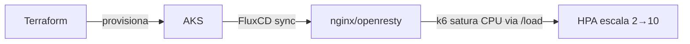

<h1 align="center">
  cp03-scalability.fiap
</h1>

<p align="center">
  
</p>



CP3: Horizontal Pod Autoscaler. AKS provisionado via Terraform, app nginx (imagem OpenResty: mesmo core nginx + módulo Lua) sincronizada via FluxCD (GitOps), HPA escalando por uso de CPU, validado com teste de carga (`k6`).

## Stack

- **Infra**: Terraform (`terraform/`): AKS na Azure.
- **GitOps**: FluxCD, sincroniza `fluxcd/nginx/` direto deste repo.
- **App**: nginx (via `openresty/openresty:alpine`), `Deployment` + `ConfigMap` (endpoint `/load` com CPU real) + `Service` (LoadBalancer) + `HorizontalPodAutoscaler` (com `behavior` tunado pra scale-up/down rápido e gradual).
- **Teste de carga**: k6 (`loadtest/k6-hpa-test.js`).

## Estrutura

```
terraform/    # provider, vnet, AKS, FluxCD (helm_release)
fluxcd/       # manifests sincronizados pelo Flux: namespace, configmap, deployment, service, hpa
loadtest/     # script k6 usado no teste de carga
docs/         # documentação detalhada por área + relatório da atividade
```

## Equipe

| Nome | RM |
|---|---|
| Anderson Huang | rm565920@fiap.com.br |
| Bruno Henrique | rm566277@fiap.com.br |
| Ronaldo Attamah | rm564630@fiap.com.br |
| Luiz Brito | rm562192@fiap.com.br |
| Guylherme Miguel | rm562374@fiap.com.br |

## Docs

| Doc | Conteúdo |
|---|---|
| [terraform/README.md](terraform/README.md) | infra AKS, versões, comandos apply |
| [fluxcd/README.md](fluxcd/README.md) | GitOps, manifests do nginx, config do HPA |
| [docs/report/README.md](docs/report/README.md) | relatório CP3: respostas, evidências, conclusão |
