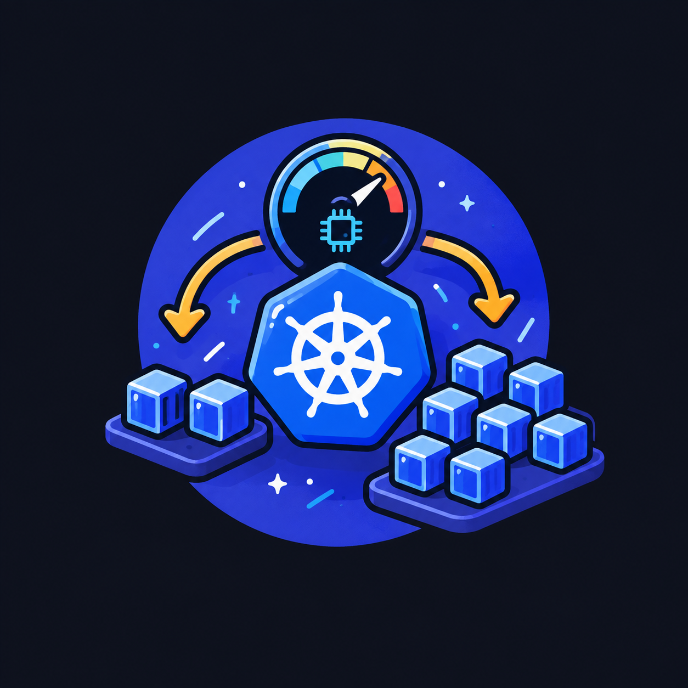
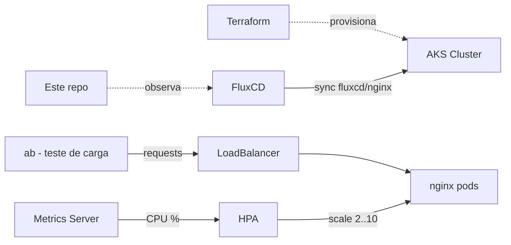

<h1 align="center">
  cp03-scalability.fiap
</h1>

<p align="center">
  
</p>

<p align="center">
  
</p>



CP3 — Horizontal Pod Autoscaler. AKS provisionado via Terraform, app nginx sincronizada via FluxCD (GitOps), HPA escalando por uso de CPU, validado com teste de carga (`ab`).

## Stack

- **Infra**: Terraform (`terraform/`) — AKS na Azure.
- **GitOps**: FluxCD, sincroniza `fluxcd/nginx/` direto deste repo.
- **App**: nginx, `Deployment` + `Service` (LoadBalancer) + `HorizontalPodAutoscaler`.
- **Teste de carga**: Apache Bench (`ab`).

## Estrutura

```
terraform/    # provider, vnet, AKS, FluxCD (helm_release)
fluxcd/       # manifests sincronizados pelo Flux: namespace, deployment, service, hpa
docs/         # documentação detalhada por área + relatório da atividade
```

## Docs

| Doc | Conteúdo |
|---|---|
| [terraform/README.md](terraform/README.md) | infra AKS, versões, comandos apply |
| [fluxcd/README.md](fluxcd/README.md) | GitOps, manifests do nginx, config do HPA |
| [docs/report/README.md](docs/report/README.md) | relatório CP3 — respostas, evidências, conclusão |
